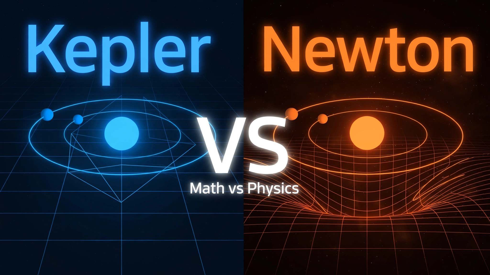

# 🌌 3D Solar System Simulation: Keplerian Geometry vs. Newtonian Dynamics

An interactive 3D Solar System physics simulation built using **Webots** and **Python**. This project demonstrates and compares geometric orbital mechanics based on **Kepler's Laws** against dynamic **N-Body Newtonian Gravity**.



---

## 📌 Overview

This project explores two fundamental approaches to orbital simulation:
1. **Keplerian Model (Kinematic / Analytical):** Positions planets along elliptical trajectories calculated analytically using Keplerian orbital elements and the **Vis-Viva equation**.
2. **Newtonian Model (Dynamic / Numerical):** Simulates real-time gravitational interactions ($N$-body problem) using **Euler-Cromer integration**, including custom techniques such as gravitational smoothing ($\epsilon = 0.1$) for close encounters and solar counter-momentum to maintain center-of-mass stability.

---

## ✨ Features

- **3D Visualization:** Physics-based simulation rendered in real-time inside **Webots**.
- **Dual Physics Engine:**
  - **Keplerian Mode:** Analytical orbital positioning.
  - **Newtonian Mode:** Full $N$-body force interactions between planets and the Sun.
- **Numerical Stability Enhancements:**
  - **Softening / Smoothing Factor ($\epsilon$):** Prevents infinite force singularities during close encounters (e.g., comets).
  - **Solar Counter-Momentum:** Counteracts total planetary momentum to keep the central star stationary.
- **Trajectory Analysis:** Integrated **Matplotlib** scripts to export and plot orbital pathways for direct model comparison.

---

## 🛠️ Mathematical Foundations

### 1. Keplerian Velocity (Vis-Viva Equation)
$$v = \sqrt{GM \left(\frac{2}{r} - \frac{1}{a}\right)}$$

### 2. Newtonian Mechanics & Euler-Cromer Integration
$$\mathbf{F}_{ij} = G \frac{m_i m_j}{(\mathbf{r}_{ij}^2 + \epsilon^2)^{3/2}} \mathbf{r}_{ij}$$

$$\mathbf{v}_{t+\Delta t} = \mathbf{v}_t + \mathbf{a}_t \Delta t$$
$$\mathbf{r}_{t+\Delta t} = \mathbf{r}_t + \mathbf{v}_{t+\Delta t} \Delta t$$

---

## 📁 Repository Structure

```text
├── newton/
│   └── Gravity_Simulation.wbt      # Webots 3D simulation world file
│   └── .Gravity_Simulation.jpg    # photo from the simulations world
│   └── gravity_controller.py   # N-Body Newtonian gravity controller
│   └── simulation_data.json    # Contains all the simulations data after running it
│   └── solar_system_orbits_hd.png   # orbits path visualization using matplotlib
├── kepler/
│   └── Kepler_Simulation.wbt      # Webots 3D simulation world file
│   └── .Kepler_Simulation.jpg    # photo from the simulations world
│   └── kepler.py   # Keplers geometry orbits controller
│   └── simulation_data.json    # Contains all the simulations data after running it
│   └── kepler_orbits_hd.png   # orbits path visualization using matplotlib
├── LICENSE                    # Open-source license (e.g., MIT)
├── kepler_vs_newton_poster.webp  # project youtube thumbnail
├── newton_vs_kepler_comparison.png  # compare both newton and kepler path visualization
└── README.md                  # Project documentation
```

## 🚀 Getting Started
Prerequisites
Ensure you have the following installed on your system:

Webots Robot Simulator (R2023b or newer recommended)

Python 3.8+

## Installation
Clone the repository:

git clone [https://github.com/YOUR_USERNAME/webots-solar-system-simulation.git](https://github.com/HayhatDev/solar-system-simulation.git)
cd solar-system-simulation
Install required Python packages:

pip install -r requirements.txt
Running the Simulation
Open Webots.

Select File -> Open World... and choose worlds/solar_system.wbt.

Press Play in Webots to observe the real-time orbital motion.

## 📊 Results & Visualization
"Kepler predicts the path. Newton calculates the physics."

The Matplotlib trajectory analysis highlights the key differences between the two paradigms:

Keplerian Orbits: Produce closed, repeating elliptical paths over time.

Newtonian Orbits: Show multi-body gravitational perturbations and orbital precession.

🎥 YouTube Overview
Check out the full video breakdown and code walkthrough on YouTube:
https://youtu.be/NqHKCTg3aJE

📜 License
Distributed under the MIT License. See LICENSE for more information.
